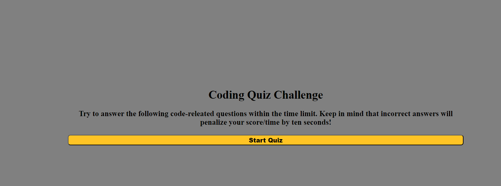
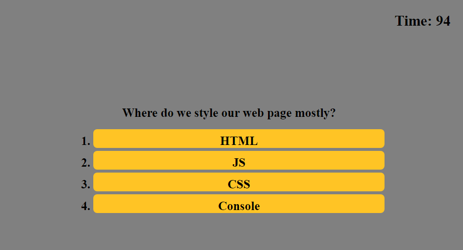
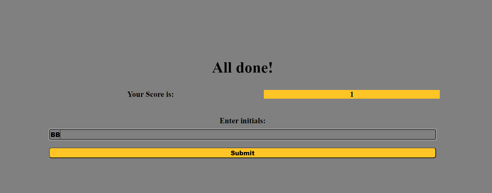
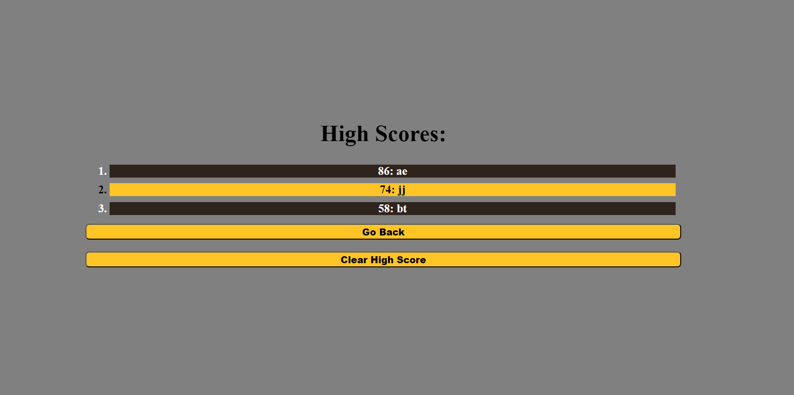

# quiz-challenge

## Description

This is my fourth challenge in the UCSD web dev course. The purpose of this site is to apply what I have learned in this course so far. The focus of this project was to bring all the different aspects of of web development that i have learned so far together. I had to work in html, css, and js to bring this project together.

- When someone clicks the start button they start a timed quiz counting down from 100 seconds.
- When someone answers they question they are presented with the next one.
- When someone answers the question wrong 10 seconds is subtracted from their score.
- When all the questions are answered or when the time runs out they can see their score and are presented with a prompt to enter their initals.
- When you enter your initals you are given the option to go back to the intro page or reset the score list.
## Installation

Open the link in my GitHub Repo!

## Usage
- First click on start quiz

#
#
#
- You will be presented with questions that change once you answer the one you are on... Notice the timer counting down it will subtract 10 seconds if you answer a question wrong.

#
#
#
- Once you answer all the questions you will prestented with a page where you can see your score and input your initials. Notice that the scores are ordered from high to low.

#
#
#
- Once you submit you are taken to a page of high scores with the option to go back to the fist page or clear the scores.

#
#
#
- This is what the high scores page looks like after you clear it.

#
#
#

## Credit:

- https://stackoverflow.com/questions/3084261/alternate-table-row-color-using-css

- https://stackoverflow.com/questions/21339624/how-to-target-a-specific-element-within-a-div-id

- https://dev.to/sulaimonolaniran/building-a-simple-quiz-with-html-css-and-javascript-4elp

- https://www.w3schools.com/jsref/prop_html_innerhtml.asp

- https://developer.mozilla.org/en-US/docs/Web/JavaScript/Reference/Global_Objects/Array/slice

- https://developer.mozilla.org/en-US/docs/Web/JavaScript/Reference/Global_Objects/Array/sort

- https://www.w3schools.com/js/js_htmldom_eventlistener.asp

- https://stackoverflow.com/questions/762011/what-is-the-difference-between-let-and-var

- https://css-tricks.com/snippets/css/a-guide-to-flexbox/

- https://www.w3schools.com/csS/css3_buttons.asp

- https://teamcolorcodes.com/san-diego-padres-color-codes/

- https://developer.mozilla.org/en-US/docs/Web/CSS/position

- https://developer.mozilla.org/en-US/docs/Web/CSS/:active

- 

- 

- 

- 

- 